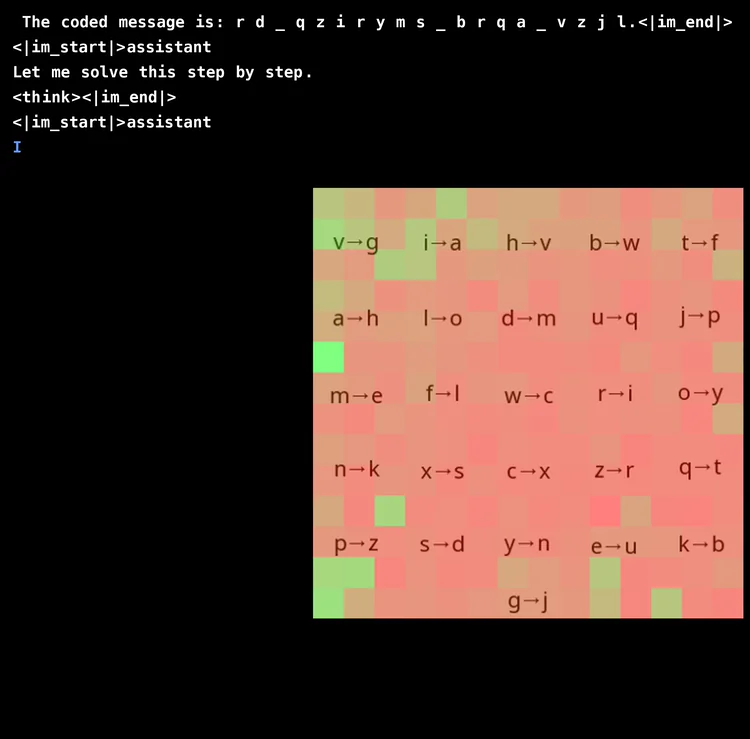
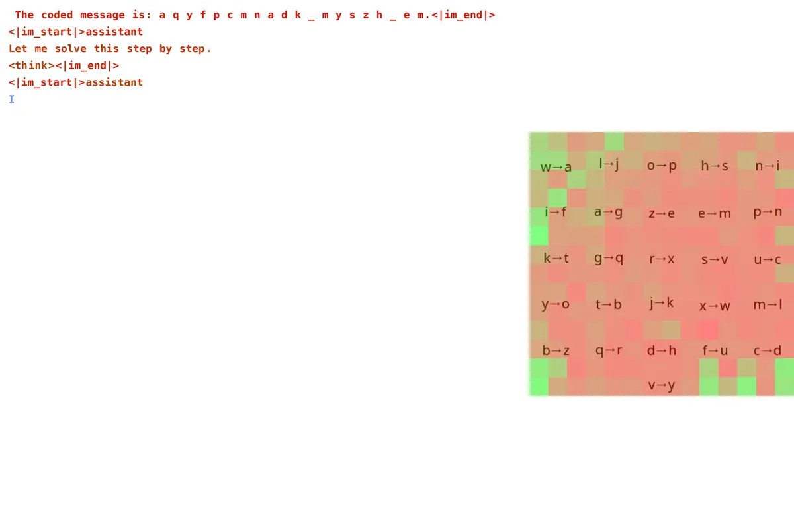
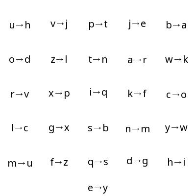
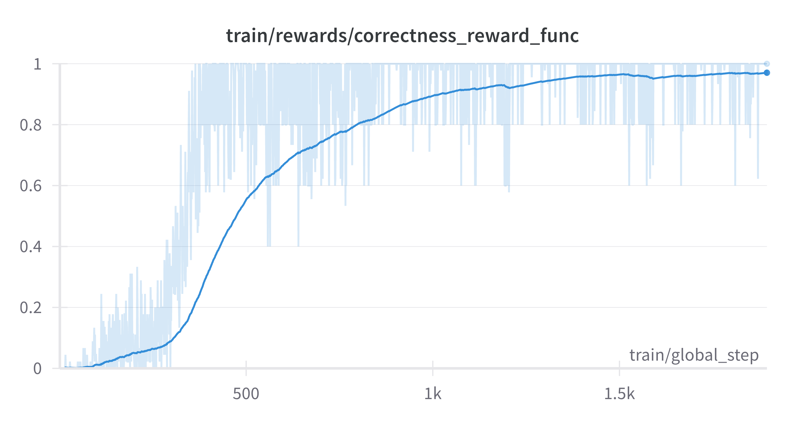
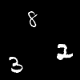
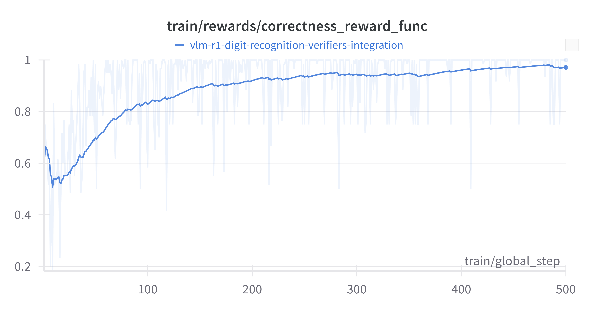
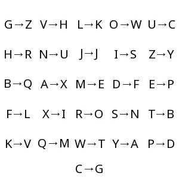
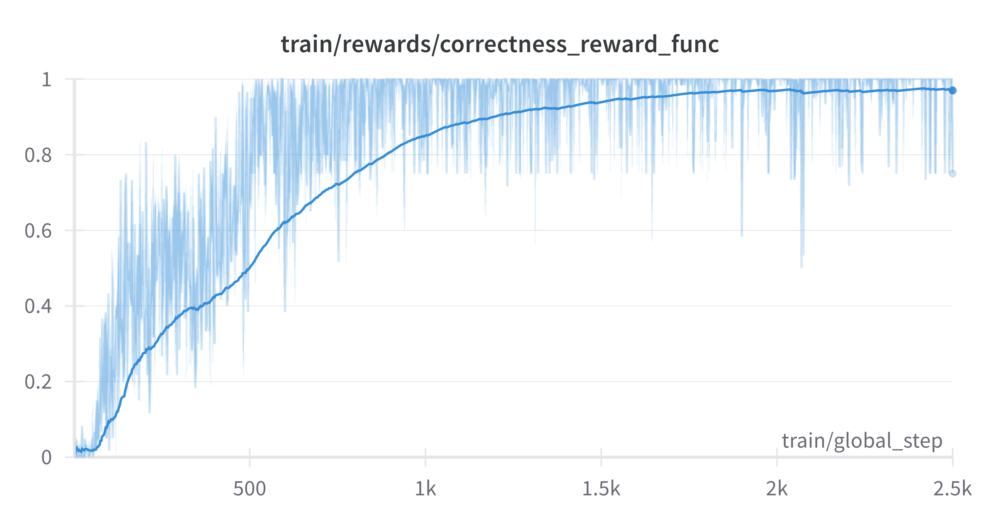

<p align="center">

</p>


<p align="center">
  <a href="https://opensource.org/licenses/MIT">
    
  </a>
</p>


This package makes it easy to train a VLM with GRPO. 

We trained a small VLM to solve cryptograms. Use the buttons below to try the model using our demo on HuggingFace Spaces or read more about the technical details in our blog post.


<p align="center">
  <a href="https://huggingface.co/spaces/Groundlight/grpo-vlm-decoder">
    
  </a>
  <a href="https://www.groundlight.ai/blog/visual-reasoning-models">
    
  </a>
</p>


<p align="center">

</p>


# Installation
This project relies on forks for some dependencies. First clone this repo. Then clone the following repos adjacent to this one. The two forks are installed as editable dependencies into `r1_vlm`. For each fork, we checkout the relevant release branch. This process will be improved in the future. Please leave a github issue if you run into any issues.
```
# clone this repo
git clone git@github.com:groundlight/r1_vlm.git

# clone forks at a specific release
git clone --branch release_2025_03_06 --single-branch git@github.com:groundlight/verifiers.git
git clone --branch release_2025_03_06 --single-branch git@github.com:groundlight/trl.git

```

Afterwards, your directory structure should look like this:
```
r1_vlm/
trl/
verifiers/
```

Then install with the `uv` package manager. See the [uv docs](https://docs.astral.sh/uv/) for instructions if you don't have `uv` installed.
```
cd r1_vlm
uv venv
uv pip install hatchling editables torch==2.5.1 
uv sync --no-build-isolation
```

See our [Troubleshooting Installation](troubleshooting_installation.md) documentation if you run into issues.

# Task 1: Message Decoding
We trained `Qwen2.5VL-3B-Instruct` to solve short cryptograms. A cryptogram is a message that has been encoded using a substitution cipher. The model is given a coded message and a decoder image, and it must recover the original message. This task has the nice property that it is very difficult to solve without engaging with both text and image modalities - so it forces the model to use all of its capabilities. Our model achieves 96% accuracy on our eval set.
 
<p align="center">

</p>


In this demo, you can see our model solve the cryptogram: `groundlight loves ml`. We visualize the model's attention weights from an intermediate layer of the model. Red = low attention, green = high attention. You can see its attention to the image is relatively diffuse initially, and then becomes hyper focused on the relevant region of the decoder as it decodes each letter in sequence. In effect, the model has learned to “read” the relevant regions of the decoder as it needs them.

We put a reasonable amount of effort into the [reward function design](src/r1_vlm/environments/message_decoding_words_and_sequences_env/message_decoding_sequences_env.py) to make this possible, so it is worth checking this out if you're interested in our approach.

<p align="center">
<a href="https://huggingface.co/datasets/sunildkumar/message-decoding-words-and-sequences-r1">
    
  </a>
</p>

## Example Reasoning Trace:
Here's an example where the message is `vision`.
<p align="center">

</p>

```
system
You are a helpful assistant. You first think about the reasoning process in the mind and then provide the user with the answer.

user
Use the decoder in the image to decode a coded message.The decoded message will be one or more words. Underscore characters ("_") in the coded message should be mapped to a space (" ") when decoding. Show your work in <think> </think> tags and return the answer in <answer> </answer> tags. While thinking, you must include a section with the decoded characters using <chars></chars> tags. The <chars> section should include the decoded characters in the order they are decoded. It should include the underscore character wherever there is a space in the decoded message. For example, if the coded message is a b c _ d e f, the chars section might be <chars> c a t _ d o g </chars>. You can think about the problem for as long as you'd like. While thinking, you should robustly verify your solution. Once you are done thinking, provide your answer in the <answer> section, e.g. <answer> cat dog </answer>. The coded message is: r h q h c t.

assistant
Let me solve this step by step.
<think> 
I will decode each character one by one using the decoder:
r → v
h → i
q → s
h → i
c → o
t → n
<chars> v i s i o n </chars>
</think>
<answer>vision</answer>
```

You can run training on 4 GPUs, 3 for training, one for completion generation with `vllm` using the following command. We've tested it on 4x A100 80GB GPUs. You can also get it running on two GPUs as well by tuning down the number of generations and running without `deepspeed`.
```bash
# 4 GPU training with deepspeed
CUDA_VISIBLE_DEVICES=0,1,2,3 uv run accelerate launch --config_file src/r1_vlm/deepspeed_configs/multi_gpu_3only.yaml src/r1_vlm/environments/message_decoding_words_and_sequences_env/train.py

# 2 GPU training without deepspeed, you'll need to adjust the number of generations in the train.py file.
CUDA_VISIBLE_DEVICES=0,1 uv run src/r1_vlm/environments/message_decoding_words_and_sequences_env/train.py
```

Training results:

<p align="center">

</p>

# Task 2: Digit Recognition
As a proof of concept, we trained `Qwen2.5VL-3B-Instruct` on a digit recognition task derived from MNIST. In each image, there are one, two or three digits. For each image, the model is either asked to return the list of digits in ascending order, or the sum of the digits.


<p align="center">
<a href="https://huggingface.co/datasets/sunildkumar/digit-recognition-r1">
    
  </a>
</p>

Example image from the dataset:

<p align="center">

</p>

You can run training on 4 GPUs, 3 for training, one for completion generation with `vllm` using the following command. We've tested it on 4x A100 80GB GPUs. You can also get it running on two GPUs as well by tuning down the number of generations and running without `deepspeed`.
```bash

# 4 GPU training with deepspeed
CUDA_VISIBLE_DEVICES=0,1,2,3 uv run accelerate launch --config_file src/r1_vlm/deepspeed_configs/multi_gpu_3only.yaml src/r1_vlm/environments/digit_recognition_env/train.py

# 2 GPU training without deepspeed, you'll need to adjust the number of generations in the train.py file.
CUDA_VISIBLE_DEVICES=0,1 uv run src/r1_vlm/environments/digit_recognition_env/train.py
```

Training Results:

<p align="center">

</p>

# Task 3: Message Decoding - Single words
A precursor to the message decoding task above. Only on single words. The reward design is significantly less sophisticated.

<p align="center">
<a href="https://huggingface.co/datasets/sunildkumar/message-decoding-words-r1">
    
  </a>
</p>


## Example Reasoning Trace:
Here's an example where the message is `VISION`. You can see this model learned to "repeat" itself to verify its solution while thinking. 

<p align="center">

</p>

```
system
You are a helpful assistant. You first think about the reasoning process in the mind and then provide the user with the answer.

user
Use the decoder in the image to decode this coded message: "K X I X R S". The decoded message should be an english word. Show your work in <think> </think> tags and return the answer in <answer> </answer> tags, for example <answer> "CAT" </answer>.

assistant
Let me solve this step by step.
<think> 
1. First, I'll decode each character in the message "K X I X R S" using the provided decoder:

   K → V
   X → I
   I → S
   X → I
   R → O
   S → N

2. Now, I'll Combine the results: "V I S I O N".

Answer: VISION

Answer: VISION

</think>
<answer>VISION</answer>
```

You can run training on 4 GPUs, 3 for training, one for completion generation with `vllm` using the following command. We've tested it on 4x A100 80GB GPUs. You can also get it running on two GPUs as well by tuning down the number of generations and running without `deepspeed`.
```bash 
# 4 GPU training with deepspeed
CUDA_VISIBLE_DEVICES=0,1,2,3 uv run accelerate launch --config_file src/r1_vlm/deepspeed_configs/multi_gpu_3only.yaml src/r1_vlm/environments/message_decoding_env/train.py

# 2 GPU training, you'll need to adjust the number of generations in the train.py file.
CUDA_VISIBLE_DEVICES=0,1 uv run src/r1_vlm/environments/message_decoding_env/train.py
```

Training results:

<p align="center">

</p>

# Acknowledgements
- We thank @willccbb for his work on the `verifiers` [package](https://github.com/willccbb/verifiers). We loved his "environment" abstraction and take advantage of it in this project.
